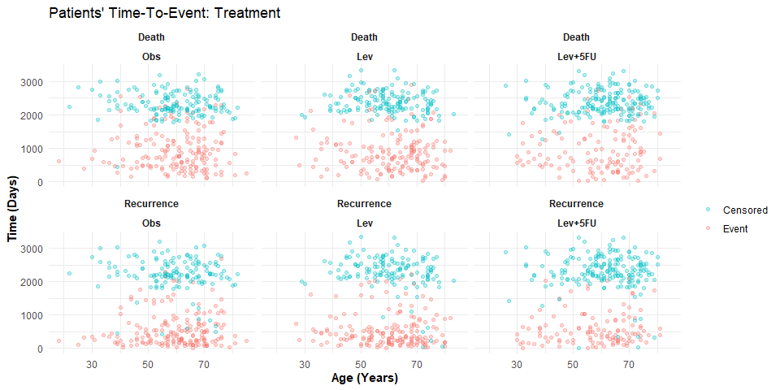
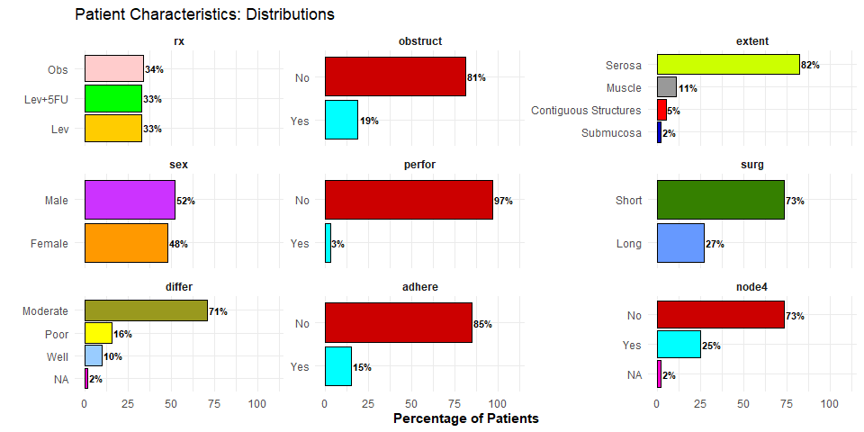
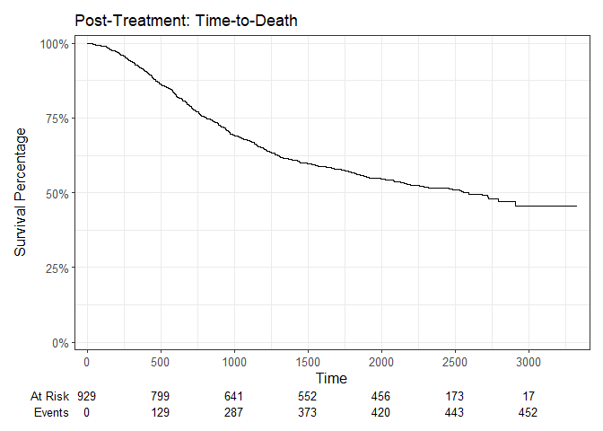
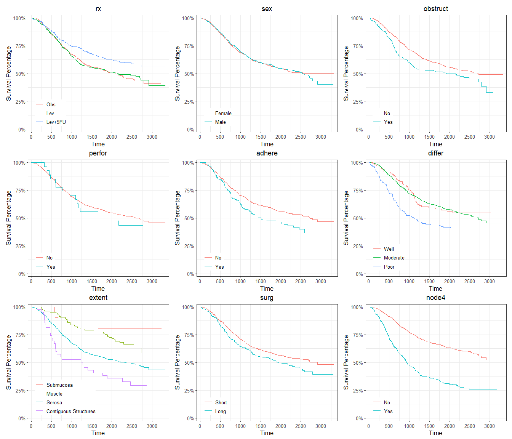
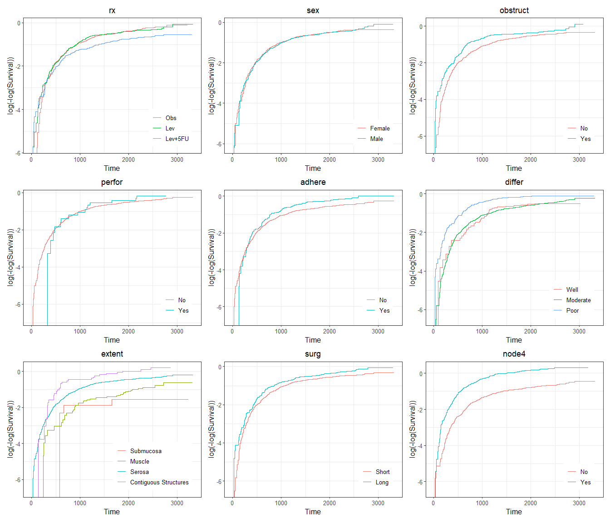
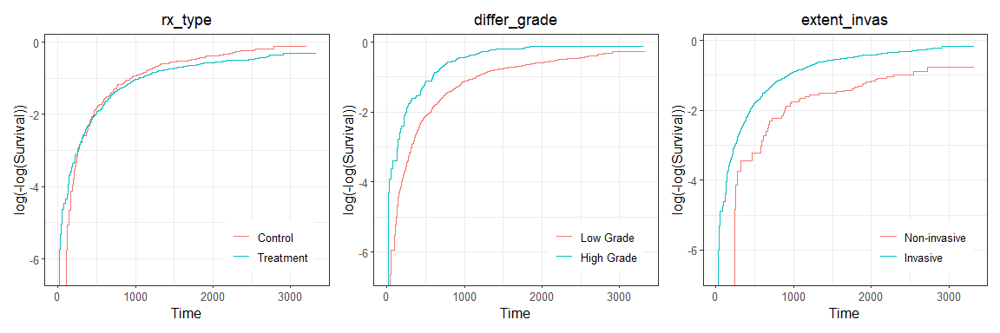
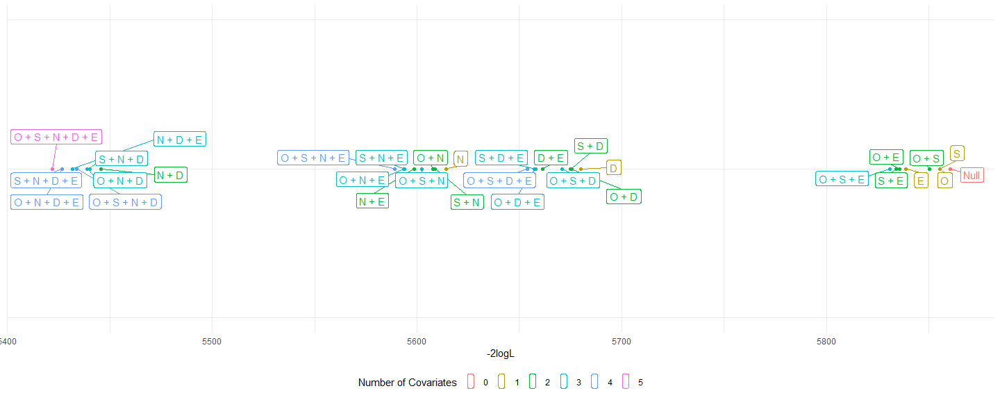

Survival Analysis: Colon Cancer
================

- [**Introduction**](#introduction)
- [**Background**](#background)
- [**Packages**](#packages)
- [**Pre-Processing & EDA**](#pre-processing--eda)
  - [**Age versus Time: Status and
    Treatment**](#age-versus-time-status-and-treatment)
  - [**Distribution of factors among
    patients**](#distribution-of-factors-among-patients)
- [**Survival Analysis**](#survival-analysis)
  - [**Kaplan-Meier Curves**](#kaplan-meier-curves)
  - [**Log-rank Tests**](#log-rank-tests)
  - [**Cox Proportional Hazards
    Model**](#cox-proportional-hazards-model)
    - [**Proportional Hazards
      Assumption**](#proportional-hazards-assumption)
    - [**Building the model**](#building-the-model)
    - [**Likelihood Ratio Test**](#likelihood-ratio-test)
    - [**Final Model**](#final-model)

## **Introduction**

We are using survival analysis techniques to decipher and understand the
colon cancer data set found in R with `survival::colon` and
`?survival::colon`  
In this workflow, we aim to understand and visualize influential factors
on patient death and build a quantitative model that compares and
assesses risks between patient groups.

## **Background**

Information about the data set can be found with `?survival::colon`  
  
The variables within the data set are:

| Variable | Description |
|:---|:---|
| study | 1 for all patients |
| rx | Treatment - Obs(ervation), Lev(amisole), Lev(amisole)+5-FU |
| sex | 1=male |
| age | in years |
| obstruct | obstruction of colon by tumour |
| perfor | perforation of colon |
| adhere | adherence to nearby organs |
| nodes | number of lymph nodes with detectable cancer |
| time | days until event or censoring |
| status | censoring status |
| differ | differentiation of tumour (1=well, 2=moderate, 3=poor) |
| extent | Extent of local spread (1=submucosa, 2=muscle, 3=serosa, 4=contiguous structures) |
| surg | time from surgery to registration (0=short, 1=long) |
| node4 | more than 4 positive lymph nodes |
| etype | event type: 1=recurrence,2=death |

## **Packages**

We will be using these packages:

``` r
library(tidyverse)
library(ggrepel)
library(survival)
library(ggsurvfit)
library(patchwork)
library(paletteer)
library(skimr)
library(kableExtra)
```

## **Pre-Processing & EDA**

Load the data set:

``` r
df <- survival::colon %>% as_tibble()
```

Previewing the data set:

``` r
df %>% head()
```

    ## # A tibble: 6 × 16
    ##      id study rx        sex   age obstruct perfor adhere nodes status differ extent  surg node4  time etype
    ##   <dbl> <dbl> <fct>   <dbl> <dbl>    <dbl>  <dbl>  <dbl> <dbl>  <dbl>  <dbl>  <dbl> <dbl> <dbl> <dbl> <dbl>
    ## 1     1     1 Lev+5FU     1    43        0      0      0     5      1      2      3     0     1  1521     2
    ## 2     1     1 Lev+5FU     1    43        0      0      0     5      1      2      3     0     1   968     1
    ## 3     2     1 Lev+5FU     1    63        0      0      0     1      0      2      3     0     0  3087     2
    ## 4     2     1 Lev+5FU     1    63        0      0      0     1      0      2      3     0     0  3087     1
    ## 5     3     1 Obs         0    71        0      0      1     7      1      2      2     0     1   963     2
    ## 6     3     1 Obs         0    71        0      0      1     7      1      2      2     0     1   542     1

``` r
df %>% skim()
```

|                                                  |            |
|:-------------------------------------------------|:-----------|
| Name                                             | Piped data |
| Number of rows                                   | 1858       |
| Number of columns                                | 16         |
| \_\_\_\_\_\_\_\_\_\_\_\_\_\_\_\_\_\_\_\_\_\_\_   |            |
| Column type frequency:                           |            |
| factor                                           | 1          |
| numeric                                          | 15         |
| \_\_\_\_\_\_\_\_\_\_\_\_\_\_\_\_\_\_\_\_\_\_\_\_ |            |
| Group variables                                  | None       |

Data summary

**Variable type: factor**

| skim_variable | n_missing | complete_rate | ordered | n_unique | top_counts |
|:---|---:|---:|:---|---:|:---|
| rx | 0 | 1 | FALSE | 3 | Obs: 630, Lev: 620, Lev: 608 |

**Variable type: numeric**

| skim_variable | n_missing | complete_rate | mean | sd | p0 | p25 | p50 | p75 | p100 | hist |
|:---|---:|---:|---:|---:|---:|---:|---:|---:|---:|:---|
| id | 0 | 1.00 | 465.00 | 268.25 | 1 | 233 | 465.0 | 697 | 929 | ▇▇▇▇▇ |
| study | 0 | 1.00 | 1.00 | 0.00 | 1 | 1 | 1.0 | 1 | 1 | ▁▁▇▁▁ |
| sex | 0 | 1.00 | 0.52 | 0.50 | 0 | 0 | 1.0 | 1 | 1 | ▇▁▁▁▇ |
| age | 0 | 1.00 | 59.75 | 11.95 | 18 | 53 | 61.0 | 69 | 85 | ▁▂▆▇▃ |
| obstruct | 0 | 1.00 | 0.19 | 0.40 | 0 | 0 | 0.0 | 0 | 1 | ▇▁▁▁▂ |
| perfor | 0 | 1.00 | 0.03 | 0.17 | 0 | 0 | 0.0 | 0 | 1 | ▇▁▁▁▁ |
| adhere | 0 | 1.00 | 0.15 | 0.35 | 0 | 0 | 0.0 | 0 | 1 | ▇▁▁▁▂ |
| nodes | 36 | 0.98 | 3.66 | 3.57 | 0 | 1 | 2.0 | 5 | 33 | ▇▁▁▁▁ |
| status | 0 | 1.00 | 0.50 | 0.50 | 0 | 0 | 0.0 | 1 | 1 | ▇▁▁▁▇ |
| differ | 46 | 0.98 | 2.06 | 0.51 | 1 | 2 | 2.0 | 2 | 3 | ▁▁▇▁▂ |
| extent | 0 | 1.00 | 2.89 | 0.49 | 1 | 3 | 3.0 | 3 | 4 | ▁▁▁▇▁ |
| surg | 0 | 1.00 | 0.27 | 0.44 | 0 | 0 | 0.0 | 1 | 1 | ▇▁▁▁▃ |
| node4 | 0 | 1.00 | 0.27 | 0.45 | 0 | 0 | 0.0 | 1 | 1 | ▇▁▁▁▃ |
| time | 0 | 1.00 | 1537.55 | 946.70 | 8 | 566 | 1855.0 | 2331 | 3329 | ▇▃▂▇▂ |
| etype | 0 | 1.00 | 1.50 | 0.50 | 1 | 1 | 1.5 | 2 | 2 | ▇▁▁▁▇ |

It is pointed out in the description that there is a discrepancy
between: nodes,node4

``` r
df %>% select(nodes,node4) %>% table()
```

    ##      node4
    ## nodes   0   1
    ##    0    4   0
    ##    1  538  10
    ##    2  388   0
    ##    3  248   2
    ##    4  162   6
    ##    5    2  90
    ##    6    0  86
    ##    7    0  76
    ##    8    2  44
    ##    9    2  38
    ##    10   0  26
    ##    11   0  20
    ##    12   0  22
    ##    13   0  14
    ##    14   0   8
    ##    15   0  12
    ##    16   0   2
    ##    17   0   4
    ##    19   0   4
    ##    20   0   4
    ##    22   0   2
    ##    24   0   2
    ##    27   0   2
    ##    33   0   2

``` r
# To fix this,

df <- df %>% 
  mutate(node4 = ifelse(nodes > 4,1,0),
         node4 = ifelse(nodes <= 4,0,1))

df %>% select(nodes,node4) %>% table()
```

    ##      node4
    ## nodes   0   1
    ##    0    4   0
    ##    1  548   0
    ##    2  388   0
    ##    3  250   0
    ##    4  168   0
    ##    5    0  92
    ##    6    0  86
    ##    7    0  76
    ##    8    0  46
    ##    9    0  40
    ##    10   0  26
    ##    11   0  20
    ##    12   0  22
    ##    13   0  14
    ##    14   0   8
    ##    15   0  12
    ##    16   0   2
    ##    17   0   4
    ##    19   0   4
    ##    20   0   4
    ##    22   0   2
    ##    24   0   2
    ##    27   0   2
    ##    33   0   2

The variables in the data set are coded numerically so we will re-code
for clarity and then convert them into factors with specified levels. We
refer to `?survival::colon` as a guide and assign `0 = No`, `1 = Yes`
for unspecified cases.

``` r
df <- df %>% 
  mutate(
    sex = case_match(sex,
                     0 ~ "Female",
                     1 ~ "Male"),
    obstruct = case_match(obstruct,
                          0 ~ "No",
                          1 ~ "Yes"),
    perfor = case_match(perfor,
                        0 ~ "No",
                        1 ~ "Yes"),
    adhere = case_match(adhere,
                        0 ~ "No",
                        1 ~ "Yes"),
    differ = case_match(differ,
                        1 ~ "Well",
                        2 ~ "Moderate",
                        3 ~ "Poor"),
    extent = case_match(extent,
                        1 ~ "Submucosa",
                        2 ~ "Muscle",
                        3 ~ "Serosa",
                        4 ~ "Contiguous Structures"),
    surg = case_match(surg,
                      0 ~ "Short",
                      1 ~ "Long"),
    node4 = case_match(node4,
                       0 ~ "No",
                       1 ~ "Yes"),
    etype = case_match(etype,
                       1 ~ "Recurrence",
                       2 ~ "Death"),
    sex = factor(sex,levels = c("Female","Male")),
    obstruct = factor(obstruct,levels = c("No","Yes")),
    perfor = factor(perfor,levels = c("No","Yes")),
    adhere = factor(adhere,levels = c("No","Yes")),
    differ = factor(differ,levels = c("Well","Moderate","Poor")),
    extent = factor(extent,levels = c("Submucosa","Muscle","Serosa","Contiguous Structures")),
    surg = factor(surg,levels = c("Short","Long")),
    node4 = factor(node4,levels = c("No","Yes"))
  )
```

Let’s confirm our changes:

``` r
df %>% head()
```

    ## # A tibble: 6 × 16
    ##      id study rx      sex      age obstruct perfor adhere nodes status differ   extent surg  node4  time etype     
    ##   <dbl> <dbl> <fct>   <fct>  <dbl> <fct>    <fct>  <fct>  <dbl>  <dbl> <fct>    <fct>  <fct> <fct> <dbl> <chr>     
    ## 1     1     1 Lev+5FU Male      43 No       No     No         5      1 Moderate Serosa Short Yes    1521 Death     
    ## 2     1     1 Lev+5FU Male      43 No       No     No         5      1 Moderate Serosa Short Yes     968 Recurrence
    ## 3     2     1 Lev+5FU Male      63 No       No     No         1      0 Moderate Serosa Short No     3087 Death     
    ## 4     2     1 Lev+5FU Male      63 No       No     No         1      0 Moderate Serosa Short No     3087 Recurrence
    ## 5     3     1 Obs     Female    71 No       No     Yes        7      1 Moderate Muscle Short Yes     963 Death     
    ## 6     3     1 Obs     Female    71 No       No     Yes        7      1 Moderate Muscle Short Yes     542 Recurrence

### **Age versus Time: Status and Treatment**

Let’s take a quick look at how age and time vary in the presence of
censoring status and treatment type:

``` r
df %>% 
  ggplot(aes(x = age,y = time,color = as.factor(status))) + 
  geom_point(alpha = 0.3) + 
  facet_wrap(etype~rx) + 
  theme_minimal() + 
  labs(x = "Age (Years)",y = "Time (Days)",color = "",
       title = "Patients' Time-To-Event: Treatment") + 
  theme(axis.title = element_text(face = "bold"),
        strip.text = element_text(face = "bold")) + 
  scale_color_manual(values = c("#00BFC4","#F8766D"),
                     labels = c("0" = "Censored","1" = "Event"))
```

<!-- -->

This data set contains information about patients’ relapse and death.
Instead of representing each event separately (thus having two entries
per patient), we may combine the events onto one row so that we reduce
the number of patient entries by half. This also makes it a bit easier
to work with down the line.

``` r
df <- df %>% 
  pivot_wider(names_from = etype,
              names_glue = "{etype}_{.value}",
              values_from = c(time,status),
              names_vary = "slowest") %>% 
  rename_with(~ str_replace_all(.,"Death_","d") %>% 
                str_replace_all("Recurrence_","r"))

df %>% head()
```

    ## # A tibble: 6 × 17
    ##      id study rx      sex      age obstruct perfor adhere nodes differ   extent surg  node4 dtime dstatus rtime rstatus
    ##   <dbl> <dbl> <fct>   <fct>  <dbl> <fct>    <fct>  <fct>  <dbl> <fct>    <fct>  <fct> <fct> <dbl>   <dbl> <dbl>   <dbl>
    ## 1     1     1 Lev+5FU Male      43 No       No     No         5 Moderate Serosa Short Yes    1521       1   968       1
    ## 2     2     1 Lev+5FU Male      63 No       No     No         1 Moderate Serosa Short No     3087       0  3087       0
    ## 3     3     1 Obs     Female    71 No       No     Yes        7 Moderate Muscle Short Yes     963       1   542       1
    ## 4     4     1 Lev+5FU Female    66 Yes      No     No         6 Moderate Serosa Long  Yes     293       1   245       1
    ## 5     5     1 Obs     Male      69 No       No     No        22 Moderate Serosa Long  Yes     659       1   523       1
    ## 6     6     1 Lev+5FU Female    57 No       No     No         9 Moderate Serosa Short Yes    1767       1   904       1

**Let’s do some sanity checks**:

Recurrence time must be less than or equal to death time since patients
cannot relapse after dying.

``` r
df %>% filter(rtime > dtime) # This should be empty
```

    ## # A tibble: 0 × 17
    ## # ℹ 17 variables: id <dbl>, study <dbl>, rx <fct>, sex <fct>, age <dbl>, obstruct <fct>, perfor <fct>, adhere <fct>, nodes <dbl>, differ <fct>, extent <fct>, surg <fct>, node4 <fct>, dtime <dbl>,
    ## #   dstatus <dbl>, rtime <dbl>, rstatus <dbl>

A patient whose recurrence status is censored (rstatus = 0) will have a
recorded recurrence time equal to their recorded death time.

``` r
temp <- df %>% filter(rstatus == 0)
identical(temp$rtime,temp$dtime)
```

    ## [1] TRUE

``` r
remove(temp) # Keep the environment clean
```

### **Distribution of factors among patients**

Now we look at how factor variables were distributed among patients:

``` r
df %>% 
  select(where(is.factor)) %>% 
  pivot_longer(everything(),names_to = "category") %>% 
  count(category,value) %>% 
  mutate(
    value = case_when(
      is.na(value) ~ "NA",
      TRUE ~ value)
  ) %>% 
  group_by(category) %>% 
  mutate("proportion" = round(n*100/sum(n)),
         category = factor(category,levels = c("rx","sex","differ",
                                               "obstruct","perfor","adhere",
                                               "extent","surg","node4"))) %>% 
  ggplot(aes(x = proportion,y = reorder(value,proportion),fill = value)) + 
  geom_col(color = "black") + 
  geom_text(aes(label = paste0(proportion,"%"),hjust = -0.1),size = 3,fontface = "bold") + 
  facet_wrap(~category,scales = "free_y",dir = "v") + 
  theme_minimal() + 
  labs(x = "Percentage of Patients",y = "",
       title = "Patient Characteristics: Distributions") + 
  theme(axis.title = element_text(face = "bold"),
        strip.text = element_text(face = "bold"),
        legend.position = "none") + 
  scale_x_continuous(limits = c(0,110),breaks = c(0,25,50,75,100)) + 
  scale_fill_paletteer_d("ggsci::default_ucscgb")
```



## **Survival Analysis**

We define the primary endpoint as overall survival so we are most
interested in time-to-death.  
We will be building a Cox proportional hazards model to compare hazard
rates between groups. and will utilize: Kaplan-Meier curves, Log-rank
tests, checking of the proportional hazards assumption, and the
Likelihood Ratio Test.  
  
Briefly:  

- Kaplan-Meier plots visualize population survival over time
- Log-rank tests assess for differences between survival curves
- Checking for violations of the proportional hazards assumption is for
  inclusion of covariates into the Cox model
- Likelihood ratio test is for goodness-of-fit in model building

#### **Kaplan-Meier Curves**

A preliminary look at all patients without any stratification gives:

``` r
survfit2(Surv(dtime,dstatus) ~ 1,data = df) %>% 
  ggsurvfit() + 
  add_risktable() + 
  scale_ggsurvfit() + 
  labs(
    y = "Survival Percentage",
    title = "Post-Treatment: Time-to-Death"
  )
```



Now let’s include our factors of interest:

``` r
factor_vars <- df %>% select(where(is.factor)) %>% names()

print(factor_vars)
```

    ## [1] "rx"       "sex"      "obstruct" "perfor"   "adhere"   "differ"   "extent"   "surg"     "node4"

``` r
kmCurve <- function(fct_var){
  formula <- as.formula(paste("Surv(dtime,dstatus) ~",fct_var))
  fit <- survfit2(formula,data = df)
  
  ggsurvfit(fit) + 
    add_risktable() + 
    scale_ggsurvfit() + 
    labs(
      y = "Survival Percentage",
      title = fct_var
    ) + 
    theme(legend.position = "inside",
          legend.position.inside = c(0.05,0.05),
          legend.justification = c("left","bottom"),
          legend.box.margin = margin(5,5,5,5),
          plot.title = element_text(hjust = 0.5))
}

map(factor_vars,kmCurve) %>% 
  wrap_plots(nrow = 3)
```



### **Log-rank Tests**

To determine if the survival distributions between groups are
significantly different, we utilize the log-rank test.

For 2 groups,  
**H<sub>0</sub>**: Survival functions are equal  
**H<sub>1</sub>**: Survival functions are not equal

For more than 2 groups,  
**H<sub>0</sub>**: All survival functions are equal  
**H<sub>1</sub>**: At least one group’s survival function is not equal

We take a significance level of $\alpha$ = 0.05

``` r
lrTest <- function(fct_var){
  formula <- as.formula(paste("Surv(dtime,dstatus) ~",fct_var))
  fit <- survdiff(formula,data = df)
}

map(factor_vars,lrTest)
```

    ## [[1]]
    ## Call:
    ## survdiff(formula = formula, data = df)
    ## 
    ##              N Observed Expected (O-E)^2/E (O-E)^2/V
    ## rx=Obs     315      168      148      2.58      3.85
    ## rx=Lev     310      161      146      1.52      2.25
    ## rx=Lev+5FU 304      123      157      7.55     11.62
    ## 
    ##  Chisq= 11.7  on 2 degrees of freedom, p= 0.003 
    ## 
    ## [[2]]
    ## Call:
    ## survdiff(formula = formula, data = df)
    ## 
    ##              N Observed Expected (O-E)^2/E (O-E)^2/V
    ## sex=Female 445      215      217   0.01049    0.0202
    ## sex=Male   484      237      235   0.00965    0.0202
    ## 
    ##  Chisq= 0  on 1 degrees of freedom, p= 0.9 
    ## 
    ## [[3]]
    ## Call:
    ## survdiff(formula = formula, data = df)
    ## 
    ##                N Observed Expected (O-E)^2/E (O-E)^2/V
    ## obstruct=No  749      354    372.7     0.938      5.35
    ## obstruct=Yes 180       98     79.3     4.407      5.35
    ## 
    ##  Chisq= 5.3  on 1 degrees of freedom, p= 0.02 
    ## 
    ## [[4]]
    ## Call:
    ## survdiff(formula = formula, data = df)
    ## 
    ##              N Observed Expected (O-E)^2/E (O-E)^2/V
    ## perfor=No  902      437    439.1   0.00995     0.348
    ## perfor=Yes  27       15     12.9   0.33832     0.348
    ## 
    ##  Chisq= 0.3  on 1 degrees of freedom, p= 0.6 
    ## 
    ## [[5]]
    ## Call:
    ## survdiff(formula = formula, data = df)
    ## 
    ##              N Observed Expected (O-E)^2/E (O-E)^2/V
    ## adhere=No  794      373    391.5     0.872      6.52
    ## adhere=Yes 135       79     60.5     5.643      6.52
    ## 
    ##  Chisq= 6.5  on 1 degrees of freedom, p= 0.01 
    ## 
    ## [[6]]
    ## Call:
    ## survdiff(formula = formula, data = df)
    ## 
    ## n=906, 23 observations deleted due to missingness.
    ## 
    ##                   N Observed Expected (O-E)^2/E (O-E)^2/V
    ## differ=Well      93       42     47.5     0.643     0.721
    ## differ=Moderate 663      311    334.9     1.708     7.108
    ## differ=Poor     150       88     58.6    14.808    17.105
    ## 
    ##  Chisq= 17.2  on 2 degrees of freedom, p= 2e-04 
    ## 
    ## [[7]]
    ## Call:
    ## survdiff(formula = formula, data = df)
    ## 
    ##                                N Observed Expected (O-E)^2/E (O-E)^2/V
    ## extent=Submucosa              21        4     12.8      6.06      6.25
    ## extent=Muscle                106       36     60.9     10.21     11.82
    ## extent=Serosa                759      383    361.7      1.26      6.29
    ## extent=Contiguous Structures  43       29     16.6      9.34      9.71
    ## 
    ##  Chisq= 26.9  on 3 degrees of freedom, p= 6e-06 
    ## 
    ## [[8]]
    ## Call:
    ## survdiff(formula = formula, data = df)
    ## 
    ##              N Observed Expected (O-E)^2/E (O-E)^2/V
    ## surg=Short 682      316      337      1.32       5.2
    ## surg=Long  247      136      115      3.87       5.2
    ## 
    ##  Chisq= 5.2  on 1 degrees of freedom, p= 0.02 
    ## 
    ## [[9]]
    ## Call:
    ## survdiff(formula = formula, data = df)
    ## 
    ## n=911, 18 observations deleted due to missingness.
    ## 
    ##             N Observed Expected (O-E)^2/E (O-E)^2/V
    ## node4=No  679      274    357.4      19.5       104
    ## node4=Yes 232      167     83.6      83.2       104
    ## 
    ##  Chisq= 104  on 1 degrees of freedom, p= <2e-16

To summarize:

| Factor   | Chi.squared |   p.value |
|:---------|------------:|----------:|
| rx       |  11.6830927 | 0.0029043 |
| sex      |   0.0201504 | 0.8871178 |
| obstruct |   5.3493382 | 0.0207301 |
| perfor   |   0.3484622 | 0.5549849 |
| adhere   |   6.5231371 | 0.0106480 |
| differ   |  17.1890944 | 0.0001851 |
| extent   |  26.9418366 | 0.0000061 |
| surg     |   5.1961444 | 0.0226370 |
| node4    | 103.5428419 | 0.0000000 |

At our defined significance level, we see that there is a difference
between survival functions for all factors, except for `sex` and
`perfor`.

### **Cox Proportional Hazards Model**

#### **Proportional Hazards Assumption**

When selecting covariates for inclusion in a Cox proportional hazards
model, it is important that the proportional hazards assumption is
satisfied. This assumption implies that, for any given covariate, the
hazard ratio between its groups remains constant over time. In other
words, the instantaneous risk of death for a group A relative to a group
B is assumed to be the same at any point during the follow-up period.

A practical method for checking this assumption is graphically with
log(-log(Survival)) curves. For the assumption to be met, the lines of
our plot should be roughly parallel and not intersecting; otherwise, the
assumption is violated.

``` r
coxphCheck <- function(fct_var){
  formula <- as.formula(paste("Surv(dtime,dstatus) ~",fct_var))
  fit <- survfit2(formula,data = df)
  
  ggsurvfit(fit,type = "cloglog") + 
    labs(
      y = "log(-log(Survival))",
      title = fct_var
    ) + 
    theme(legend.position = "inside",
          legend.position.inside = c(0.95,0.05),
          legend.justification = c("right","bottom"),
          legend.box.margin = margin(5,5,5,5),
          plot.title = element_text(hjust = 0.5))
}

map(factor_vars,coxphCheck) %>% 
  wrap_plots(nrow = 3)
```



From our curves, we see parallel behavior in: `obstruct`, `surg`,
`node4` and non-parallel behavior in: `rx`, `sex`, `perfor`, `adhere`,
`differ`, `extent`

We could build a Cox model with our 3 variables but because we are
interested in the effects of treatment and tumor status (differentiation
and progression), we will include `rx`, `differ`, and `extent`. However,
we will need to perform some remedies first since these variables
violate the proportional hazards assumption.  
  
**Merging Variables**  
We can create new levels from existing values but it is important that
we do this judiciously so that we best preserve original meaning of our
data.  

`rx`: It would be natural to make **Treatment** (Lev,Lev+5FU) versus
**Control** (Obs) groups.

`differ`: Tumor differentiation refers to how abnormal cancer cells
appear under a microscope. **Well-differentiated** cells resemble normal
cells while **poorly-differentiated** cells are more irregular. A
grading system classifies the former as **low-grade** tumors and the
latter as **high-grade** tumors; low-grade tumors are less likely to
grow and spread than the more aggressive high-grade tumors.

`extent`: we may re-label based upon tumor invasiveness. Since the colon
wall is structured as: **submucosa**, **muscle**, **serosa**, a tumor
extending to **submucosa**/**muscle** area will be classified as
**non-invasive**, while patients whose tumors extend beyond
(**serosa**/**surrounding structures**) will be classified as
**invasive**.  
  

``` r
df <- df %>% 
  mutate(
    rx_type = case_when(
      rx == "Obs" ~ "Control",
      rx == "Lev" ~ "Treatment",
      rx == "Lev+5FU" ~ "Treatment"
    ),
    differ_grade = case_when(
      differ == "Well" ~ "Low Grade",
      differ == "Moderate" ~ "Low Grade",
      differ == "Poor" ~ "High Grade"
    ),
    extent_invas = case_when(
      extent == "Submucosa" ~ "Non-invasive",
      extent == "Muscle" ~ "Non-invasive",
      extent == "Serosa" ~ "Invasive",
      extent == "Contiguous Structures" ~ "Invasive"
    ),
    rx_type = factor(rx_type,levels = c("Control","Treatment")),
    differ_grade = factor(differ_grade,levels = c("Low Grade","High Grade")),
    extent_invas = factor(extent_invas,levels = c("Non-invasive","Invasive"))
  )

map(c("rx_type","differ_grade","extent_invas"),coxphCheck) %>% 
  wrap_plots(nrow = 1)
```



Through re-merging of our values, we have resolved violations of the
proportional hazards assumption for variables `differ` and `extent`. For
`rx`, we utilize stratification as our next strategy.  
  
When we include a covariate into our Cox model, we are assessing its
effect on the hazard rate given the assumption that the hazard ratio
between groups does not change over time. Since we cannot make the
assumption that the hazard ratio between our treatment groups does not
change over time, we stratify it so that we create new baseline hazard
functions for each level and instead assess the effects of our other
covariates on hazard rate **relative** to our treatment groups. We still
assume that the effects of our covariates are consistent across strata.

#### **Building the model**

To build the Cox model, we will consider all of our variables of
interest and keep those that significantly improve upon the base model
on the principle of the likelihood ratio test.

#### **Likelihood Ratio Test**

In order to determine which parameters are added to our Cox model, we
perform the likelihood ratio test (LRT). We compare the log-likelihoods
of two competing models (reduced versus full) so that we can calculate
the corresponding test statistic to determine if the full model is a
better fit for our data. If the test statistic is statistically
significant, then we conclude that the full model (p + 1 parameters) is
a better fit than the reduced model (p parameters), where the additional
parameter is the one being considered for addition.  
  
Formally, we test:  
**H<sub>0</sub>**: $\beta$ = 0  
**H<sub>1</sub>**: $\beta$ ≠ 0  
where $\beta$ represents the coefficient of the parameter being added to
the model.

The likelihood ratio test statistic, **G**, is given by the difference
in log-likelihoods:
$G = -2(\log(L_{\text{reduced}}) - \log(L_{\text{full}}))$

Since **G** asymptotically follows a chi-squared distribution, we
compare this to a known critical value–typically, this will be 3.841
since $\chi_{df = 1,\alpha = 0.05}^2$ = 3.841 (it is 1 degree of freedom
since we are assessing the addition of a **single** parameter).

If **G** \> 3.841:  
We reject **H<sub>0</sub>** and conclude that **there is sufficient
evidence** to suggest that the value of $\beta$ is nonzero and that the
parameter is a part of the new model.

Otherwise, if **G** \< 3.841:  
We fail to reject **H<sub>0</sub>** and conclude that **there is not
enough evidence** to suggest that $\beta$ is nonzero. We do not include
the parameter into the model.

  
**Feature Selection**  
  
We begin by considering which variable to add first:  

    ##   Covariate Combination minus2logL          G
    ## 1                     .   5860.383   0.000000
    ## 2                  surg   5855.376   5.006869
    ## 3              obstruct   5855.327   5.056630
    ## 4          extent_invas   5838.859  21.524800
    ## 5          differ_grade   5679.900 180.483520
    ## 6                 node4   5614.200 246.183592

Our table shows that all variables are statistically significant;
`differ_grade` and `node4` appear to be the best choices. We’ll select
`node4` as the first addition to the base model.

**`.`** versus **`node4`**, G = 5860.383 - 5614.200 = **246.183** \>
3.841

    ##   Covariate Combination minus2logL          G
    ## 1          surg + node4   5608.899   5.300601
    ## 2      obstruct + node4   5607.762   6.437220
    ## 3  node4 + extent_invas   5598.493  15.707159
    ## 4  node4 + differ_grade   5445.586 168.613916

We look for a second variable that would be significant when added to
`node4`. Again, all are significant; we will go with `differ_grade`.

**`node4`** versus **`node4 + differ_grade`**, G = 5614.200 - 5445.586 =
**168.614** \> 3.841

    ##                 Covariate Combination minus2logL         G
    ## 1         surg + node4 + differ_grade   5440.138  5.448082
    ## 2     obstruct + node4 + differ_grade   5439.014  6.572109
    ## 3 node4 + differ_grade + extent_invas   5431.717 13.869188

The third addition to our model `node4 + differ_grade` is
`extent_invas`.

**`node4 + differ_grade`** versus
**`node4 + differ_grade + extent_invas`**, G = 5445.586 - 5431.717 =
**13.869** \> 3.841

    ##                            Covariate Combination minus2logL        G
    ## 1 obstruct + node4 + differ_grade + extent_invas   5426.796 4.920830
    ## 2     surg + node4 + differ_grade + extent_invas   5426.708 5.009029

In our selection for a fourth variable, we see that the addition of
either `obstruct` or `surg` to `node4 + differ_grade + extent_invas` is
statistically significant, although only a slight improvement from the
base model. For the purpose of this analysis, we will select `surg`.

**`node4 + differ_grade + extent_invas`** versus
**`surg + node4 + differ_grade + extent_invas`**, G = 5431.717 -
5426.708 = **5.009** \> 3.841

    ##                                   Covariate Combination minus2logL        G
    ## 1 obstruct + surg + node4 + differ_grade + extent_invas   5421.923 4.784859

We are now down to our final variable `obstruct`. Adding this to our
base model is statistically significant but only a slight improvement
from our base model, similar to our previous addition. Again, for the
purpose of this analysis, we will incorporate the parameter into our
model.

`surg + node4 + differ_grade + extent_invas` versus
`obstruct + surg + node4 + differ_grade + extent_invas`, G = 5426.708 -
5421.923 = **4.785** \> 3.841

  
To summarize:

    ##                Coded                                 Covariate Combination minus2logL Number of Covariates dummy_y
    ## 1               Null                                                     .   5860.383                    0       0
    ## 2                  S                                                  surg   5855.376                    1       0
    ## 3                  O                                              obstruct   5855.327                    1       0
    ## 4              O + S                                       obstruct + surg   5850.378                    2       0
    ## 5                  E                                          extent_invas   5838.859                    1       0
    ## 6              O + E                               obstruct + extent_invas   5835.733                    2       0
    ## 7              S + E                                   surg + extent_invas   5834.187                    2       0
    ## 8          O + S + E                        obstruct + surg + extent_invas   5831.113                    3       0
    ## 9                  D                                          differ_grade   5679.900                    1       0
    ## 10             S + D                                   surg + differ_grade   5675.564                    2       0
    ## 11             O + D                               obstruct + differ_grade   5674.967                    2       0
    ## 12         O + S + D                        obstruct + surg + differ_grade   5670.797                    3       0
    ## 13             D + E                           differ_grade + extent_invas   5661.245                    2       0
    ## 14         O + D + E                obstruct + differ_grade + extent_invas   5657.951                    3       0
    ## 15         S + D + E                    surg + differ_grade + extent_invas   5657.251                    3       0
    ## 16     O + S + D + E         obstruct + surg + differ_grade + extent_invas   5654.098                    4       0
    ## 17                 N                                                 node4   5614.200                    1       0
    ## 18             S + N                                          surg + node4   5608.899                    2       0
    ## 19             O + N                                      obstruct + node4   5607.762                    2       0
    ## 20         O + S + N                               obstruct + surg + node4   5602.505                    3       0
    ## 21             N + E                                  node4 + extent_invas   5598.493                    2       0
    ## 22         O + N + E                       obstruct + node4 + extent_invas   5593.866                    3       0
    ## 23         S + N + E                           surg + node4 + extent_invas   5593.580                    3       0
    ## 24     O + S + N + E                obstruct + surg + node4 + extent_invas   5589.005                    4       0
    ## 25             N + D                                  node4 + differ_grade   5445.586                    2       0
    ## 26         S + N + D                           surg + node4 + differ_grade   5440.138                    3       0
    ## 27         O + N + D                       obstruct + node4 + differ_grade   5439.014                    3       0
    ## 28     O + S + N + D                obstruct + surg + node4 + differ_grade   5433.709                    4       0
    ## 29         N + D + E                   node4 + differ_grade + extent_invas   5431.717                    3       0
    ## 30     O + N + D + E        obstruct + node4 + differ_grade + extent_invas   5426.796                    4       0
    ## 31     S + N + D + E            surg + node4 + differ_grade + extent_invas   5426.708                    4       0
    ## 32 O + S + N + D + E obstruct + surg + node4 + differ_grade + extent_invas   5421.923                    5       0



Our selection process resulted in the 5-parameter model:
`obstruct + surg + node4 + differ_grade + extent_invas`. Each parameter
addition was shown to be significant and that the full model was a
better fit than the reduced model. It would be reasonable to use this
combination of parameters for our Cox model but our above summary table
and visual suggest that there may be a better set of parameters.

Referring to our visual, we see that all parameter combinations can be
classified into roughly 4 groups–with our 5-parameter model being at the
far left. Values on the x-axis represent that particular model’s
log-likelihood ($-2(\log(L))$). Generally and informally speaking, a
full model is a better fit than the null model when its x-value is
smaller and further away from the null model.

We see that our 5-parameter model is grouped with several other models
and relevantly remember that in statistical modeling, a simpler model is
often preferred to a complex one when they both explain the same thing.
When we began looking at this data set about patients with colon cancer
and started to investigate factors that most influenced death rates, we
expected for treatment types and tumor statuses to be the most
important. Our above visual shows that this model `N + D + E` or
`node4 + differ_grade + extent_invas` is indeed a good fit for our data
as it is not too far away from our 5-parameter model (3-parameter:
5431.717 and 5-parameter: 5421.923); we will take this 3-parameter model
in favor of the 5-parameter model.

This decision is arguably subjective in nature but given the context of
the data and the surrounding domain knowledge, it is justifiable to
trade-off the parameters in favor of a simpler model, given that both
explain the data properly.

Finally, we have decided to stratify upon `rx`, the treatment variable,
so we have:

`strata(rx) + node4 + differ_grade + extent_invas`

When a stratified variable is present, we need to consider if the
variable’s interactions with the remaining covariates is significant.  
Formally, we test:  
**H<sub>0</sub>**: No interaction between stratified variable and
covariates  
**H<sub>1</sub>**: There is interaction between stratified variable and
covariates

We compare the log-likelihoods, compare the test statistic, and state
our conclusion.

``` r
# Stratification without interaction
reducedmodel <- coxph(Surv(dtime,dstatus) ~ node4 + differ_grade + extent_invas + strata(rx), data = df)

# Stratification with interaction
fullmodel <- coxph(Surv(dtime,dstatus) ~ node4 + differ_grade + extent_invas + node4*rx + differ_grade*rx + extent_invas*rx + strata(rx), data = df)

# Likelihood Ratio Test
print(-2*reducedmodel[["loglik"]][2] - -2*fullmodel[["loglik"]][2])
```

    ## [1] 1.883702

There is a difference of 3 parameters so $\chi_{df = 3,\alpha = 0.05}^2$
= 7.815 \> LRT = 1.884. Our test statistic is less than the critical
value so we fail to reject **H<sub>0</sub>** suggesting that our reduced
model (witout interaction terms) is the better model.

#### **Final Model**

We build a Cox model with parameters:
`rx`,`node4`,`differ_grade`,`extent_invas`

``` r
coxph(Surv(dtime,dstatus) ~ node4 + differ_grade + extent_invas + strata(rx), data = df)
```

    ## Call:
    ## coxph(formula = Surv(dtime, dstatus) ~ node4 + differ_grade + 
    ##     extent_invas + strata(rx), data = df)
    ## 
    ##                          coef exp(coef) se(coef)     z        p
    ## node4Yes               0.9004    2.4606   0.1009 8.920  < 2e-16
    ## differ_gradeHigh Grade 0.3474    1.4154   0.1237 2.809 0.004965
    ## extent_invasInvasive   0.5786    1.7835   0.1708 3.388 0.000705
    ## 
    ## Likelihood ratio test=104.8  on 3 df, p=< 2.2e-16
    ## n= 888, number of events= 430 
    ##    (41 observations deleted due to missingness)

**Interpretation**

Across all treatment groups,

- Patients with more than 4 positive lymph nodes are 2.5x more likely to
  die than those with less than 4 positive lymph nodes.
- Patients with high-grade tumors are 1.4x more likely to die than those
  with low-grade tumors.
- Patients with invasive-tumors are 1.8x more likely to die than those
  with non-invasive tumors.
